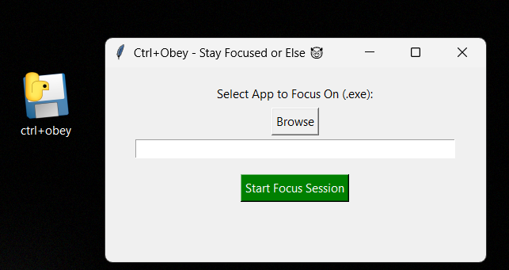
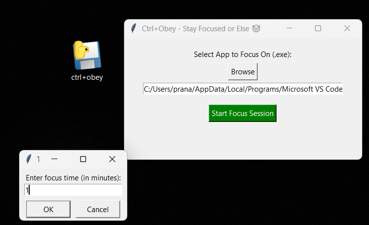
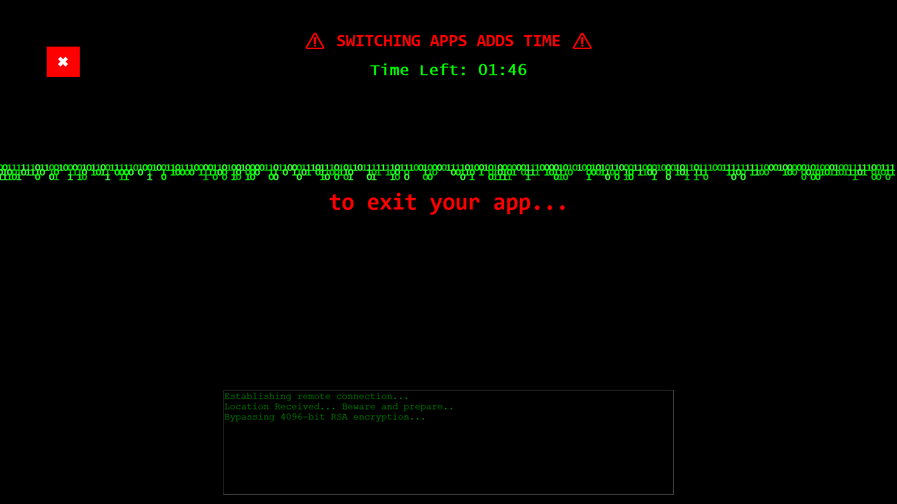
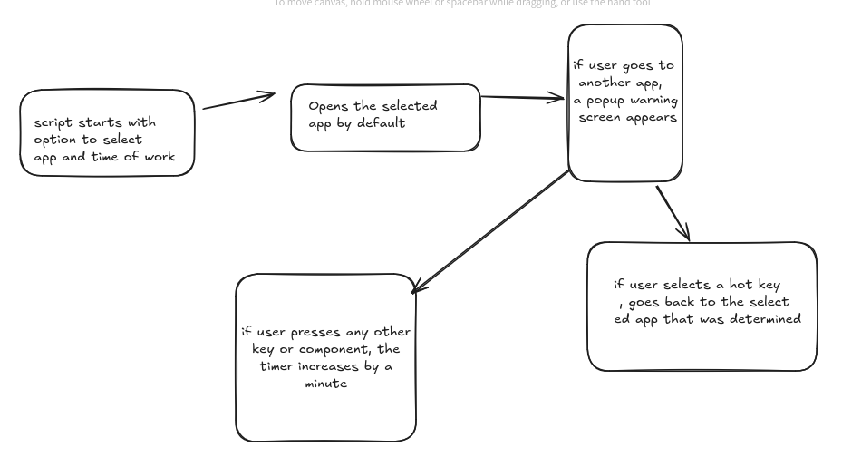

# CTRL + OBEY 😈

### Team Name: The Pantheon

### Team Members
- Team Lead: [Pranav M](https://github.com/trulyPranav/) - Model Engineering College
- Member 2: [Joe George](https://github.com/malignant-18) - Model Engineering College

### Project Description
Turns your choice of an app(that you want to focus on) to hell(or heaven if you're that good). Ctrl + Obey - Stay Focused or Else 😈<br>
Get **_time as a reward_**, well what more to ask? 😈

### The Problem (that doesn't exist)
Ever find that random surge of motivation, where you feel you can take down the world with just a system?!<br>
Random spike of energy, build a startup tech or reasearch about a paper, all in one go?!!<br>
But heyy! But I'm switching windows/tabs in between(sounds familiar?). That's the problem!<br>
And that's extacly where we come in! Just CTRL + Obey 😈<br>

### The Solution (that nobody asked for)
Well, we have often heard nobody gets lost time back. Hmmmm, let's work on that then ;) <br>
What about an app that let's you focus on one app entirely..? Hmm okay, already exists? <br>
What about an app that let's you focus on one app entirely and if you switch app in between, well then you learn it the hard way 😈<br>
Presenting the **Hell Blur**, where you will be challenged to exit it to return to your app(of choice?), but it ain't that easy!<br>
Put together the clues, drag your mouse as far as you can, press any keys you like. One wrong move and you get one lost minute. Yes!<br>
ONE LOST MINUTE IS ADDED TO YOUR PRO(blem)DUCTIVITY!<br>
Well, until you exit and focus, it's your game! 😈<br>

# Technical Details
### Technologies/Components Used
For Software:
- **Languages used**: Python 😈
- **Frameworks used**: Tkinter GUI
- **Libraries used**: PyAutoGUI, PyGetWindow, pygame, ffpyplayer, MouseInfo, keyboard, PyScreeze
- **Tools used**: VS CODE, a bit of cmd(terminal ofc), and baked in GitHub!

# Installation
Install the latest release or if you're lazy(like us) install it [here](https://github.com/trulyPranav/CTRL-Obey/releases/download/v1.0.0/ctrl+obey.exe)
```
WARNING: Find the hotkey. Only yoU can find it. If anything goes wrong, close the GUI from the tabbar.
WE WON'T BE THIS CONSIDERATE NEXT TIME! 
```

# Run
```
git clone https://github.com/trulyPranav/CTRL-Obey.git
python ctrl+obey.py
```
```
WARNING: KEEP THE APP YOU CHOOSE AND CMD OPEN IF RUNNING WITHOUT .exe SETUP. ELSE.... 😈.....
(Okay real warning: Don't close the app you choose or cmd, you might get trapped in the maze forever!(Just Restart if that happens ;))
```

# Screenshots

<br>
*User to browse and input an executable app to focus on*


<br>
*User sets his deadly timer 😈*


<br>
*Part of the Hell Blurr 😈*

# Diagrams

*Workflow showing the base idea of project, from app selection to different actions*

# Video
[Link to Demo Video](https://drive.google.com/file/d/1sGuiiLnLPnjFxOXpnBbHWtN_WWBaPwlR/view?usp=sharing)

*The video demonstrates the working of CTRL+Obey. From launching the app, being "productive", until viewing the Hell Blur mechanisms. Currently only three ways exists to exit the Hell Blur 😈: Timer Ends, HOTKEYYYYYYY and the Tab Closing(until we background this task 😈)*


# Fun Apart - The Reality
- Changing screens would app an extra 1min to the overall timer set by the user
- Use the HotKey "u" to switch back to the app selected
- While installing and running the .exe, if selected app is closed, just close the GUI from tabbar
- All the green texts shown in the lower box is nothing but gibberish (what even is AmongUsOS?!)
- ALT + F4 won't work. Instead, it would add more time, a minute to be specific.
- While running the script, use a venv, keep the **terminal** and the **app** selected open:
    - If anything occurs, **Ctrl + C** the cmd
    - If no other options persist, restart from **Ctrl + Alt + Del**

## Team Contributions
 - Pranav M:
    - Developed the core Python script to monitor and detect foreground applications.
    - Implemented logic to control keyboard and mouse access for enhanced control.
- Joe George
    - Designed and implemented the Tkinter-based user interface for alert popups.
    - Created an animated warning screen to enhance user feedback and visual alert system.

---
Made with ❤️ at TinkerHub Useless Projects 


